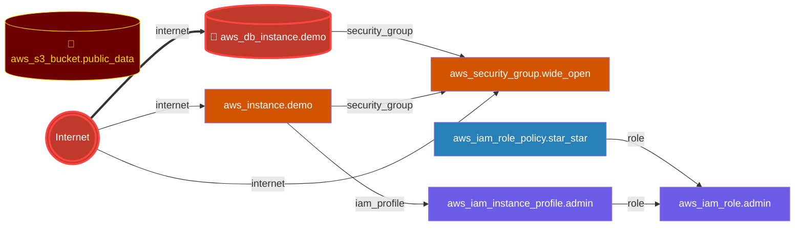

# tf-analyze-action-demo

End-to-end demo for the **[`ChrisAdkin8/tf-analyze`](https://github.com/marketplace/actions/tf-analyze)** GitHub Action.

Open a pull request that touches `terraform/**` and the workflow exercises every load-bearing feature of the action: HIGH-threshold gating, inline `suggestion` comments, the engine-rendered PR summary, the OWASP IaC compliance gap report, and the Mermaid attack-graph block.

> [!CAUTION]
> The `terraform/` directory is **intentionally insecure** — a teaching fixture for the scanner. Do not deploy any of it. See [SECURITY.md](SECURITY.md).

---

## Quickstart

1. **Fork or clone** this repo into your own account.
2. **Push a no-op change** to `terraform/main.tf` on a branch and open a PR. The simplest way:
   ```sh
   git clone https://github.com/<you>/tf-analyze-action-demo
   cd tf-analyze-action-demo
   git checkout -b trigger-demo
   echo "# trigger" >> terraform/main.tf
   git commit -am "trigger tf-analyze"
   git push -u origin trigger-demo
   gh pr create --fill
   ```
3. **Watch the action run.** Within ~90s you should see:
   - A status check on the PR (red, because the fixture trips multiple HIGH findings — `fail-on: HIGH` is doing its job).
   - A bot comment with the engine-rendered PR summary (score, top findings, Mermaid attack graph, collapsible OWASP IaC compliance section).
   - Inline review comments with `suggestion` blocks on the lines that introduced findings — click **Apply suggestion** to one-click-fix.
   - A SARIF upload in the repo's **Security → Code scanning alerts** tab.
   - An `tf-analyze-report` artifact on the workflow run (HTML report, 30-day retention).

That's the entire demo. The rest of this README explains the moving parts.

---

## The workflow

[`.github/workflows/tf-analyze.yml`](.github/workflows/tf-analyze.yml) wires the action up in the smallest possible way:

```yaml
- uses: ChrisAdkin8/tf-analyze@v1
  with:
    fail-on: HIGH
    post-pr-comment: true
    compliance-framework: owasp_iac
    attack-graph: true
    ref: v0.2.5
```

The workflow also declares:

- **Triggers**: `pull_request` on changes to `terraform/**` (so docs-only PRs don't burn minutes) plus `push` to `main` for the post-merge baseline run.
- **Permissions**: `pull-requests: write` is the load-bearing one — without it `post-pr-comment` silently no-ops. `security-events: write` is needed for the SARIF upload to Code Scanning. `contents: read` is the default.

---

## Per-input reference

Every input the action accepts, with the demo's value and what other values do. Sourced from [`action.yml`](https://github.com/ChrisAdkin8/tf-analyze/blob/v1/action.yml).

| Input | Default | Demo value | What it does |
|---|---|---|---|
| `target` | `.` | _(default)_ | Path within the workspace to scan. Useful if your Terraform lives in a subdirectory. |
| `fail-on` | `HIGH` | `HIGH` | Minimum urgency that fails the check. Allowed: `CRITICAL`, `HIGH`, `MEDIUM`, `LOW`, `INFO`. Set to `CRITICAL` for a softer gate, `MEDIUM` for a stricter one. |
| `mode` | `auto` | _(default)_ | Engine mode. `auto` resolves to `diff` on `pull_request` events and `static` elsewhere. Other values: `plan`, `fleet`, `trend`, `pr-review`. |
| `section` | _(empty)_ | _(default)_ | Restrict to one catalogue section. Useful when you only want `security` rules or want to silo `robustness`/`ops`. |
| `attack-graph` | `true` | `true` | Build the internet → crown-jewels attack graph and promote critical-path findings one urgency tier. Embeds a Mermaid graph in the PR summary. |
| `baseline` | _(empty)_ | _(default)_ | Path to a prior JSON report. Findings present in the baseline are suppressed; only **new** findings affect the exit code. Useful for legacy repos with a known baseline of issues. |
| `post-pr-comment` | `true` | `true` | Posts the engine-rendered PR summary as a bot comment and inline `suggestion` blocks on changed lines. Requires `permissions: pull-requests: write`. |
| `upload-sarif` | `true` | _(default)_ | Uploads `tf-analyze.sarif` to GitHub Code Scanning. Requires `permissions: security-events: write`. |
| `upload-html-artifact` | `true` | _(default)_ | Uploads the HTML report as a 30-day workflow artifact. |
| `compliance-framework` | _(empty)_ | `owasp_iac` | Optional compliance gap report. Allowed: `cis`, `pci_dss`, `soc2`, `owasp_iac`, `all`. Adds a collapsible compliance section to the PR comment. Validated — an unknown framework fails the action with `::error::`. |
| `ref` | _(empty)_ | `v0.2.5` | Shorthand for the image tag. `ref: v0.2.5` is equivalent to `image: ghcr.io/chrisadkin8/tf-analyze:0.2.5` — the leading `v` is stripped before building the docker tag (R31.6), so both `v0.2.5` and `0.2.5` work. Non-semver values (`main`, `latest`) pass through untouched. **Mutually exclusive with `image:`.** |
| `image` | `ghcr.io/chrisadkin8/tf-analyze:latest` | _(default)_ | Engine Docker image. Override to pin (or to test a fork). Mutually exclusive with `ref:`. |
| `extra-args` | _(empty)_ | _(default)_ | CLI flags appended verbatim to `detect.py`. Read-then-tokenized via `read -ra` (no shell-substitution). Useful for `--check-registry`, `--oscal PATH`, `--pdf-output PATH`. |

### Outputs

The action also exposes the following outputs for downstream steps:

| Output | Description |
|---|---|
| `score` | Risk score 0–100. |
| `grade` | Letter grade — `A`, `B`, `B-`, `C`, `D`, or `F`. |
| `total-findings` | Total findings count (all urgencies). |
| `critical-count` | CRITICAL findings only. |
| `high-count` | HIGH findings only. |
| `json-report-path` / `html-report-path` / `sarif-report-path` | Absolute paths to the generated reports. |

---

## The fixture

[`terraform/main.tf`](terraform/main.tf) deliberately wires a real privilege-escalation chain so the attack-graph block has something interesting to render.

| Resource | Findings |
|---|---|
| `aws_s3_bucket.public_data` | public-read ACL, public-access-block disabled, no encryption, no versioning |
| `aws_security_group.wide_open` | `0.0.0.0/0` ingress on 22 (SSH) and 3389 (RDP); unrestricted egress |
| `aws_db_instance.demo` | `publicly_accessible = true`, `storage_encrypted = false`, hardcoded `password = "SuperSecret123!"`, `skip_final_snapshot = true` |
| `aws_iam_role_policy.star_star` | `Action: "*"` on `Resource: "*"` attached to the EC2 instance role |
| `aws_instance.demo` | IMDSv1 allowed (`http_tokens = "optional"`), unencrypted root volume, attached to the wide-open SG and the admin role, public IP |

The chain — **public-internet EC2 → admin IAM role → star/star policy** — is what the attack graph surfaces. Even a single weak link is interesting; the full chain is *why* prioritization-by-path-centrality matters.

---

## Reading the output

> [!TIP]
> **Live walkthrough**: [**PR #1**](https://github.com/ChrisAdkin8/tf-analyze-action-demo/pull/1) is kept open permanently as a copy-pasteable example of every output the action produces. Every shape described below appears on that PR.

### 1. The bot comment

A single auto-upserted comment at the top of the PR carrying the engine's `--format pr-summary` Markdown. On a PR that touches `terraform/**` here's roughly what posts:

```markdown
## tf-analyze: 98 (A) 🟢
**0** CRITICAL · **0** HIGH · **0** MEDIUM · **2** LOW · 2 total

### Top findings

| Urgency | Rule | Location |
|---|---|---|
| **MEDIUM** | [`ROB-AWS-BACKUP-001`](https://chrisadkin8.github.io/tf-analyze/rules/ROB-AWS-BACKUP-001/) — No AWS Backup plan defined | `/workspace:0` |
| **MEDIUM** | [`SEC-AWS-S3-LOGGING-001`](https://chrisadkin8.github.io/tf-analyze/rules/SEC-AWS-S3-LOGGING-001/) — S3 bucket missing server access logging | `/workspace:0` |

### Top fix — ROB-AWS-BACKUP-001 *(`none`)*

(hcl block with the suggested fix here)

<details><summary>🛤 Attack graph: 11 nodes · 8 edges · 3 crown jewels</summary>

(Mermaid graph here — see next section)

</details>

<sub>🛡 Generated by tf-analyze · full rule reference</sub>
```

Score is high on a PR because `mode: auto` resolves to **diff mode** — only *new* findings count, not the pre-existing baseline of insecure resources. On the post-merge `push: main` run the same workflow runs in **static mode** and scores 0 (F) on the full corpus.

### 2. The attack graph (Mermaid)

GitHub renders Mermaid inline in any Markdown block. The collapsed `<details>` from the bot comment, expanded, looks like this — and this is the actual graph from the demo's fixture:



**How to read it:**

| Glyph | Meaning |
|---|---|
| `(((Internet)))` | The external attacker entry point. |
| `[("👑 …")]` | A **crown jewel** — a resource the engine identified as a high-value target (data store, secret, etc). Highlighted gold-on-blood-red. |
| `["aws_security_group.wide_open"]` (orange fill) | A **reachable** resource — has a network path from the Internet. |
| `==>` (thick edge) | A **critical path** — direct reachability to a crown jewel without intermediate gating. This is what trips urgency promotion (HIGH findings on critical-path resources get promoted to CRITICAL). |
| `-->` (thin edge) | An ordinary edge — semantic dependency, not necessarily reachable. |

In the graph above, the critical edge is `INTERNET ==> aws_db_instance.demo` because the database has `publicly_accessible = true` *and* its security group accepts `0.0.0.0/0`. Even though the database itself isn't directly on a `wide_open` SG ingress port (5432), the engine's reachability analysis combines the two.

### 3. Inline review comments

For every fixable finding whose `line` falls inside the PR diff, the action posts a separate review comment with a `suggestion` block. GitHub renders these with an **Apply suggestion** button — one click, your branch gets the fix as a new commit. Example from the demo PR (verbatim, only formatting added):

> 💡 **[SEC-AWS-S3-001]** — S3 bucket missing server-side encryption configuration
>
> Urgency: `MEDIUM` · Disruption: `plan_required`
>
> *Adversarial scenario:* Unencrypted data in `aws_s3_bucket.logs` is readable in plaintext by any AWS principal with `s3:GetObject`, including anyone who obtains temporary credentials via SSRF, stolen access keys, or a confused-deputy attack on an over-permissioned role. The 2017 Verizon and 2017 Accenture incidents both involved S3 buckets with sensitive data exposed without encryption, compounding the impact of misconfigured access controls.
>
> ```suggestion
> resource "aws_s3_bucket_server_side_encryption_configuration" "example" {
>   bucket = aws_s3_bucket.example.id
>   rule {
>     apply_server_side_encryption_by_default {
>       sse_algorithm     = "aws:kms"
>       kms_master_key_id = aws_kms_key.example.arn
>     }
>   }
> }
> ```

The narrative (`*Adversarial scenario*`) is the engine's `adversarial_scenario` field — a real-incident-grounded explanation of *why* this finding matters, not just *what* it is. It's the single most actionable difference between this scanner and the classic "rule X failed" output of competing tools.

**Three constraints on inline suggestions** (otherwise the suggestion isn't posted):

1. The finding must have a `fix_hcl` payload (most do; some advisory rules don't).
2. The finding's `line` must be a real line number (not `0`, which means "the resource as a whole").
3. The line must be inside the PR's diff hunks (i.e. a line you actually touched in this PR).

Mismatch on any of those and the suggestion is silently skipped — the bot comment's footer reports a count so you know how many made it.

### 4. Code Scanning alerts (SARIF)

`upload-sarif: true` posts findings to **Security → Code scanning alerts**. Each alert is keyed on `rule_id + file + line` so re-runs upsert rather than duplicate. Click an alert to see the engine's narrative (`adversarial_scenario`) and the canonical rule docs URL via `helpUri`. Useful when:

- The PR comment was dismissed but you want a persistent record
- You need to track remediation progress over time
- Your org has SARIF-aware tooling (DefectDojo, GitHub Advanced Security dashboards, etc.)

### 5. HTML report (workflow artifact)

`upload-html-artifact: true` attaches `tf-analyze-report.html` to the workflow run (30-day retention by default). Click into the workflow run → bottom of the page → **Artifacts** → `tf-analyze-report` to download. The HTML report is the **most complete view** — it includes:

- Everything the bot comment shows
- The full findings table (not just top 3)
- **The compliance gap report** in full — control-by-control PASS/FAIL with reasoning (currently the only output surface that renders the full compliance section; see the known gap below)
- Inline `<pre>` blocks with the catalogue YAML for each rule
- The full attack graph + an extra crown-jewel-by-crown-jewel breakdown

Share the HTML externally (Slack, email, ticketing) when the PR comment isn't enough.

### Compliance gap section (in the PR comment)

When `compliance-framework: <name>` is set (the demo uses `owasp_iac`), the bot comment grows a collapsible compliance block right after the attack graph. Example shape from the demo PR's bot comment:

```markdown
<details><summary>📋 Compliance (owasp_iac): 🔴 4/9 PASS · 5 FAIL</summary>

| Control | Status | Mapped rules |
|---|---|---|
| `Develop and Distribute / Secrets Detection` | ❌ FAIL | **[`SEC-SECRETS-001`](…)**, [`SEC-SENSITIVE-001`](…), … |
| `Develop and Distribute / Open Source Dependency Scanning` | ✅ PASS | [`MOD-PIN-001`](…), [`MOD-STALE-001`](…), … |
| …
</details>
```

Failures sort to the top so reviewers see the most actionable rows first. Rules that fired are **bolded**; all rule IDs link to canonical docs pages. The threshold indicator is `🟢` ≥80% PASS, `🟡` 50–79%, `🔴` <50%.

This block was added in [R31.8](https://github.com/ChrisAdkin8/tf-analyze/blob/main/CHANGELOG.md#round-318--pr-summary-compliance-section--safety-net-wrapper--2026-05-13) (issue [#12](https://github.com/ChrisAdkin8/tf-analyze/issues/12)). Earlier action versions (`v0.2.4` and below) had the input wired through but the engine never embedded the rendered section in `pr-summary`. Pin `ref: v0.2.5` or later to see it.

---

## Using the action's outputs

Every input is reflected back as a step output you can reference from downstream steps. Concrete examples:

```yaml
- id: tfa
  uses: ChrisAdkin8/tf-analyze@v1
  with:
    fail-on: HIGH
    post-pr-comment: true
    ref: v0.2.5

# Surface the score to Slack on main pushes
- name: Notify Slack
  if: github.event_name == 'push' && github.ref == 'refs/heads/main'
  env:
    SCORE: ${{ steps.tfa.outputs.score }}
    GRADE: ${{ steps.tfa.outputs.grade }}
    TOTAL: ${{ steps.tfa.outputs.total-findings }}
    CRITICAL: ${{ steps.tfa.outputs.critical-count }}
  run: |
    curl -X POST $SLACK_WEBHOOK -d "{
      \"text\": \"tf-analyze on main: ${SCORE} (${GRADE}) — ${TOTAL} findings (${CRITICAL} CRITICAL)\"
    }"

# Embed the HTML report into a PR comment via its absolute path
- name: Read HTML for inline preview
  if: github.event_name == 'pull_request'
  run: |
    head -c 4096 "${{ steps.tfa.outputs.html-report-path }}" > preview.html

# Fail a release-blocking check independently of fail-on
- name: Refuse release if any CRITICAL
  if: ${{ steps.tfa.outputs.critical-count != '0' }}
  run: |
    echo "::error::Release blocked: ${{ steps.tfa.outputs.critical-count }} CRITICAL findings"
    exit 1
```

The full list of outputs is in the [per-input reference](#per-input-reference) table above.

---

## Verification checklist

After you open your first PR against this repo (or a fork), tick these off — if any fails, jump to the [troubleshooting](#troubleshooting) table:

- [ ] The PR shows a **failing status check** named `analyze` (the `fail-on: HIGH` gate tripping is the expected outcome on the insecure fixture, *not* a configuration error).
- [ ] A bot comment posts at the top of the PR within ~90 seconds of the PR being opened.
- [ ] The bot comment includes a **score banner** at the top (e.g. `tf-analyze: 98 (A)` or `0 (F)`).
- [ ] If your diff touches an insecure resource line, **inline review comments** appear with `suggestion` blocks and an **Apply suggestion** button.
- [ ] The **Mermaid attack graph** renders as an actual diagram (not a code block) — if it shows as fenced code, your org has Mermaid rendering disabled in Markdown.
- [ ] **Security → Code scanning alerts** has new entries categorized as `tf-analyze`.
- [ ] The workflow run page has a downloadable `tf-analyze-report` artifact.

If all seven pass, the demo is working end-to-end and you can confidently adopt the action in a real repo.

---

## FAQ

**Q: Can I run this on Windows or macOS runners?**

The action is a composite action wrapping a multi-arch Docker image (`linux/amd64` + `linux/arm64`). It runs on any GitHub runner that has Docker — including Linux ARM runners, self-hosted runners with Docker installed, etc. It does *not* run natively on Windows or macOS runners because they don't ship with Linux Docker. Use a `runs-on: ubuntu-latest` matrix slot if your project's main matrix uses other OSes.

**Q: Does it work on Terraform Cloud / HCP / Spacelift / Atlantis?**

Indirectly. tf-analyze is a static analyzer — it reads `.tf` files and does not interact with Terraform state, plans, or runs. So it can run as a CI gate *alongside* TFC/HCP/Spacelift/Atlantis (e.g. on the same PR), but it doesn't replace any of them. The `mode: plan` option can also parse `terraform show -json plan.bin` output if you want plan-time analysis.

**Q: Does it work on Terragrunt?**

Yes — Terragrunt's HCL is a superset of Terraform's, and tf-analyze parses any `.tf` / `.hcl` file. Module-reuse and registry analysis works the same. The `terragrunt.hcl` files themselves are mostly orchestration, so most findings still fire on the underlying modules.

**Q: Why does the same PR sometimes score 98 (A) and sometimes 0 (F)?**

Because `mode: auto` (the default) resolves to **diff mode** on `pull_request` events — only *new* findings on touched lines affect the exit code and the score. On `push` events (typically the post-merge run on `main`), the same mode resolves to **static** and scans the full corpus. To always scan the full corpus on PRs, set `mode: static` explicitly.

**Q: Can a PR from a fork post comments back to the upstream repo?**

By default no — GitHub treats forked-PR workflow tokens as read-only (`pull-requests: read`), so the action's `createReviewComment` call 403s and you get the bot summary but no inline suggestions. The fix is either: (a) configure **Settings → Actions → General → Workflow permissions** to grant write to forked PRs, or (b) move to a `pull_request_target`-triggered workflow (carries the secrets/perms of the base repo — but read [the GitHub security guidance](https://securitylab.github.com/research/github-actions-preventing-pwn-requests/) first; `pull_request_target` is footgun-prone).

**Q: How do I silence a finding I've reviewed and accepted?**

Three options, in increasing order of permanence:

1. Comment the line out with `# tfsec:ignore` / `# tf-analyze:ignore` (the engine respects per-line ignore comments).
2. Run the action once on `main`, commit the JSON output as `baseline.json`, then set `baseline: baseline.json` on PR runs — pre-existing findings are suppressed at half-weight; only *new* ones affect the exit code.
3. Edit the catalogue YAML for the rule to add `applies_when:` constraints if the rule is firing inappropriately for your context. (Requires a fork of the engine.)

**Q: Will the action burn through my Actions minutes?**

The workflow takes 60–120 seconds per run (cold cache 90–120s, warm cache 60–80s). On a free public repo that's free. On a private repo, the cost is ~$0.008 per run at Linux pricing — pull this number down further by adding aggressive `paths:` filters to your trigger so the action only runs when `terraform/**` actually changes.

**Q: Why is the docker tag stripped of the `v` (as `:0.2.5` not `:v0.2.5`)?**

`docker/metadata-action` (the official Docker image-tagging action) strips the `v` from semver tags by default — `:0.2.5`, `:0.2`, `:latest`. The R31.6 fix to the action made `ref:` accept *both* forms (`v0.2.5` and `0.2.5`) so you can paste whichever form you copied from. See [upstream CHANGELOG R31.6](https://github.com/ChrisAdkin8/tf-analyze/blob/main/CHANGELOG.md#round-316--ref-accepts-both-v023-and-023-forms--2026-05-13) for the underlying mechanic.

---

## Customizing the demo

Things to try by editing [`.github/workflows/tf-analyze.yml`](.github/workflows/tf-analyze.yml):

- **Tighten the gate**: `fail-on: MEDIUM` will flip more PRs red. `fail-on: CRITICAL` makes the check almost never fail.
- **Swap compliance frameworks**: `compliance-framework: cis` or `pci_dss` or `soc2` or `all`. Each renders a different gap report. `''` (empty) disables the section entirely.
- **Disable the attack graph**: `attack-graph: false` removes the Mermaid block and turns off path-centrality urgency promotion.
- **Pin a different engine version**: `ref: v0.2.3` to roll back one patch; `ref: latest` for the floating tag; `image: ghcr.io/<your-fork>/tf-analyze:latest` to test a fork.
- **Section filter**: `section: security` to scan only the `security` catalogue; useful for huge repos where `robustness` noise dominates.
- **Baseline a legacy repo**: run the action once on `main`, commit the JSON to the repo as `baseline.json`, then set `baseline: baseline.json` on PR runs. Only *new* findings affect the exit code.

---

## Troubleshooting

| Symptom | Likely cause | Fix |
|---|---|---|
| Workflow didn't run on the PR | Triggered paths don't match | The trigger filters on `terraform/**` and `.github/workflows/tf-analyze.yml`. Touch one of those, or remove the `paths:` filter. |
| No bot comment | `permissions: pull-requests: write` missing | Check the top of [`tf-analyze.yml`](.github/workflows/tf-analyze.yml). Forked PRs into your own repo also drop write permissions by default; configure **Settings → Actions → General → Workflow permissions** to allow it. |
| `Unexpected input(s)` warnings | You're on an old `@v1` predating R31.5 | Update `uses:` to `ChrisAdkin8/tf-analyze@v1` (the floating tag picks up the latest release). Verify the action commit at `https://github.com/ChrisAdkin8/tf-analyze/actions`. |
| Action errors on `compliance-framework must be one of …` | Typo or unsupported framework | Valid: `cis`, `pci_dss`, `soc2`, `owasp_iac`, `all`. Lower-case, underscore-separated. |
| Action errors on `'ref' and 'image' are mutually exclusive` | You set both inputs | Pick one. `ref:` is shorthand for `image: ghcr.io/chrisadkin8/tf-analyze:<ref>`; pass the explicit `image:` only when pulling from a fork or non-default registry. |
| Mermaid graph doesn't render | Org disabled Mermaid in Markdown | **Settings → General → Features** in your org settings. The graph is a `<details>`-collapsed fenced block, so other readers still see the source. |
| SARIF doesn't appear in Security tab | Code scanning not enabled, or `security-events: write` missing | Enable code scanning under **Security → Code scanning** (it's free for public repos). Check the permissions block in the workflow. |

---

## Links

- **Action source**: [`ChrisAdkin8/tf-analyze`](https://github.com/ChrisAdkin8/tf-analyze) — engine, catalogue, action.yml
- **Marketplace listing**: [marketplace/actions/tf-analyze](https://github.com/marketplace/actions/tf-analyze)
- **Per-rule docs**: [chrisadkin8.github.io/tf-analyze/rules/](https://chrisadkin8.github.io/tf-analyze/rules/) — every rule has a canonical page (linked from PR comments, SARIF `helpUri`, and the Findings panel)
- **VS Code extension**: [`vscode-extension/`](https://github.com/ChrisAdkin8/tf-analyze/tree/main/vscode-extension) — same engine, in-editor diagnostics + Quick Fix + attack-graph panel
- **Showcase corpora**: [`examples/attack-graph-demo`](https://github.com/ChrisAdkin8/tf-analyze/tree/main/examples/attack-graph-demo), [`examples/module-reuse-demo`](https://github.com/ChrisAdkin8/tf-analyze/tree/main/examples/module-reuse-demo) — bigger fixtures than this one

---

## License

MIT — see [LICENSE](LICENSE).
